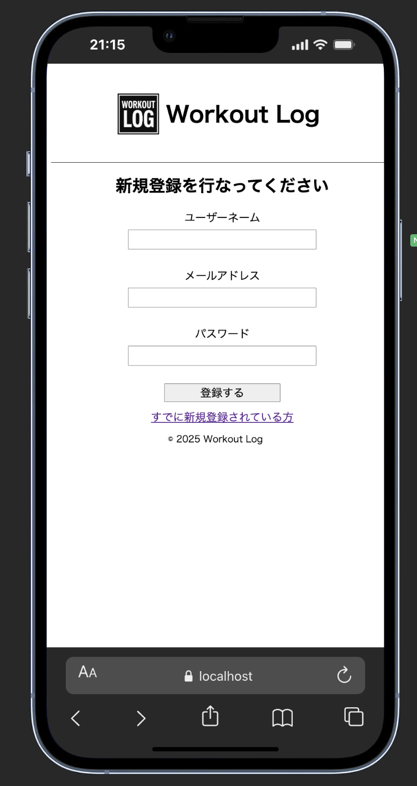
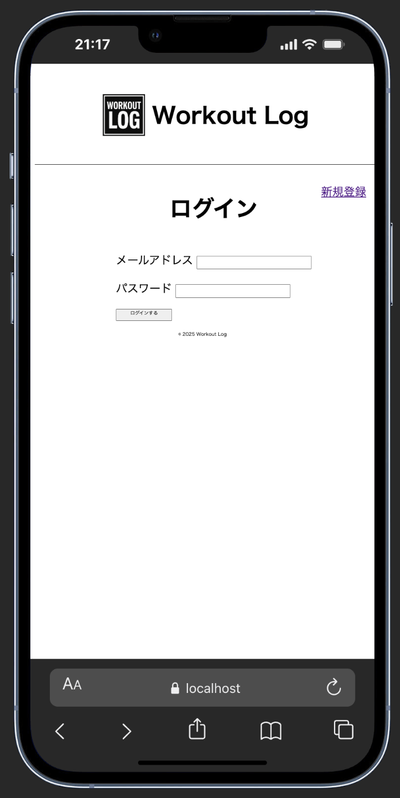
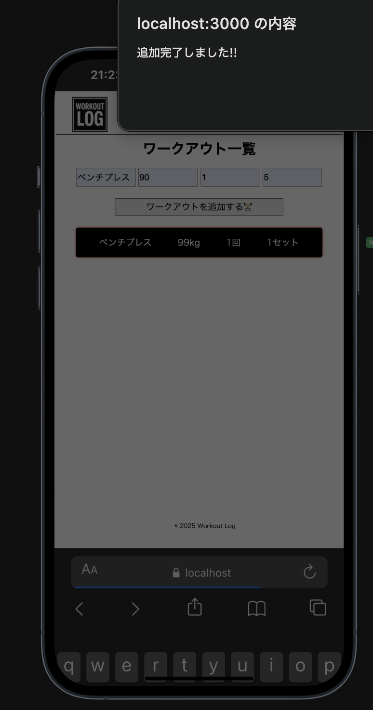
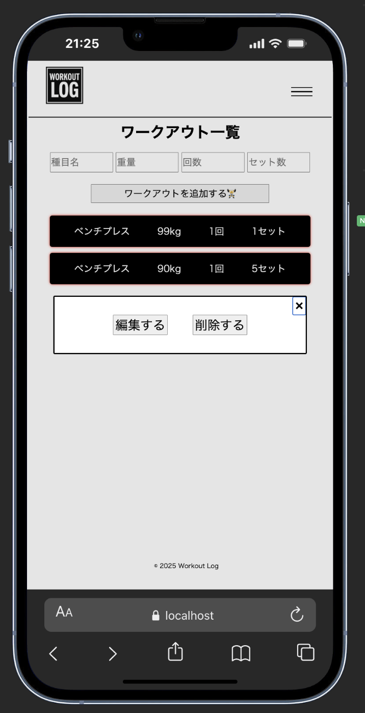

FlaskとNode.jsを使用した筋トレアプリです。

#注意：このアプリケーションはChromeのモバイル電話シミュレーターで使用することをお勧めします。

#使い方
まず、リモートリポジトリをローカルにコピーします。
git clone https://github.com/matsuzoe-taiki/workout-Node-app.git

親フォルダに移動します。
cd workout_Node_app

仮想環境をactivateにします。
sourse venv/bin/activate

backendファイルに移動します。
cd backend

バックエンドサーバーを起動させます。
FLASK_APP=app.py flask run --debug

frontendファイルに移動します。
cd frontend

フロントエンドサーバーを起動させます。
npx nodemon server.js

ブラウザを開いて新規登録を行います。

ログインを行います。

ワークアウト一覧画面で、種目名、重量、回数、セット数を入力してワークアウトを追加するボタンを押します。

各ワークアウトカードを押すと、編集、削除のボタンが出力されます。

